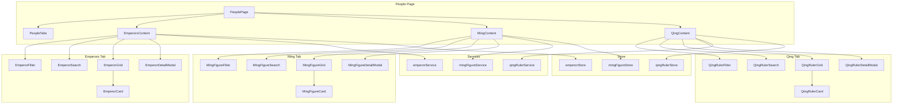

# Design Document: People Page Refactor

## Overview

本设计文档描述了人物页面（PeoplePage）的重构方案，将现有的按职业分类展示功能替换为三个功能完整的标签页：历代帝王、明朝人物、清朝人物。

设计遵循项目现有的组件模式（参考CulturePage），使用Material-UI组件库，支持响应式布局，并提供搜索、筛选和排序功能。

## Architecture



## Components and Interfaces

### 1. PeoplePage (主页面组件)

```typescript
// frontend/src/features/people/PeoplePage.tsx
interface PeoplePageProps {}

type TabValue = 'emperors' | 'ming' | 'qing';

function PeoplePage(): JSX.Element {
  const [activeTab, setActiveTab] = useState<TabValue>('emperors');
  // 根据activeTab渲染对应内容
}
```

### 2. PeopleTabs (标签导航组件)

```typescript
// frontend/src/features/people/components/PeopleTabs.tsx
interface PeopleTabsProps {
  activeTab: TabValue;
  onTabChange: (tab: TabValue) => void;
}

function PeopleTabs({ activeTab, onTabChange }: PeopleTabsProps): JSX.Element;
```

### 3. EmperorCard (帝王卡片组件)

```typescript
// frontend/src/features/people/components/EmperorCard.tsx
interface EmperorCardProps {
  emperor: Emperor;
  onClick: () => void;
}

function EmperorCard({ emperor, onClick }: EmperorCardProps): JSX.Element;
```

### 4. EmperorDetailModal (帝王详情弹窗)

```typescript
// frontend/src/features/people/components/EmperorDetailModal.tsx
interface EmperorDetailModalProps {
  emperor: Emperor | null;
  open: boolean;
  onClose: () => void;
}

function EmperorDetailModal({ emperor, open, onClose }: EmperorDetailModalProps): JSX.Element;
```

### 5. EmperorFilter (帝王筛选组件)

```typescript
// frontend/src/features/people/components/EmperorFilter.tsx
interface EmperorFilterProps {
  selectedDynasty: string;
  onDynastyChange: (dynasty: string) => void;
  dynastyOptions: string[];
  sortBy: 'reignStart' | 'dynasty';
  onSortChange: (sort: 'reignStart' | 'dynasty') => void;
  searchQuery: string;
  onSearchChange: (query: string) => void;
  resultCount: number;
}

function EmperorFilter(props: EmperorFilterProps): JSX.Element;
```

### 6. EmperorGrid (帝王网格组件)

```typescript
// frontend/src/features/people/components/EmperorGrid.tsx
interface EmperorGridProps {
  emperors: Emperor[];
  onEmperorClick: (emperor: Emperor) => void;
  loading: boolean;
}

function EmperorGrid({ emperors, onEmperorClick, loading }: EmperorGridProps): JSX.Element;
```

### 7. MingFigureCard / QingRulerCard (明清人物卡片)

类似EmperorCard，但展示不同的字段。

### 8. MingFigureDetailModal / QingRulerDetailModal (明清人物详情弹窗)

类似EmperorDetailModal，但展示不同的详细信息。

## Data Models

### Emperor (帝王数据模型)

```typescript
// frontend/src/services/emperor/types.ts
import { z } from 'zod';

export interface EraName {
  name: string;        // 年号名称
  startYear: number;   // 起始年
  endYear: number;     // 结束年
}

export interface HistoricalEvaluation {
  source: string;      // 来源（如《史记》、《资治通鉴》）
  content: string;     // 评价内容
  author?: string;     // 作者
}

export interface Emperor {
  id: string;
  name: string;                    // 姓名
  templeName?: string;             // 庙号
  posthumousName?: string;         // 谥号
  dynasty: string;                 // 朝代
  dynastyPeriod?: string;          // 朝代时期（如西汉、东汉）
  reignStart: number;              // 在位起始年（负数表示公元前）
  reignEnd: number;                // 在位结束年
  eraNames: EraName[];             // 年号列表
  achievements: string[];          // 主要功绩
  failures: string[];              // 重大失误
  evaluations: HistoricalEvaluation[]; // 历史评价
  biography?: string;              // 简介
  portraitUrl?: string;            // 画像URL
  sources: string[];               // 参考资料
}

export const EraNameSchema = z.object({
  name: z.string(),
  startYear: z.number(),
  endYear: z.number(),
});

export const HistoricalEvaluationSchema = z.object({
  source: z.string(),
  content: z.string(),
  author: z.string().optional(),
});

export const EmperorSchema = z.object({
  id: z.string(),
  name: z.string(),
  templeName: z.string().optional(),
  posthumousName: z.string().optional(),
  dynasty: z.string(),
  dynastyPeriod: z.string().optional(),
  reignStart: z.number(),
  reignEnd: z.number(),
  eraNames: z.array(EraNameSchema),
  achievements: z.array(z.string()),
  failures: z.array(z.string()),
  evaluations: z.array(HistoricalEvaluationSchema),
  biography: z.string().optional(),
  portraitUrl: z.string().optional(),
  sources: z.array(z.string()),
});
```

### MingFigure (明朝人物数据模型)

```typescript
// frontend/src/services/mingFigure/types.ts
import { z } from 'zod';

export type MingFigureRole = 'emperor' | 'cabinet' | 'general' | 'official' | 'other';

export interface HistoricalEvent {
  name: string;        // 事件名称
  year: number;        // 发生年份
  role: string;        // 人物在事件中的角色
  description: string; // 事件描述
}

export interface MingFigure {
  id: string;
  name: string;                    // 姓名
  courtesy?: string;               // 字
  birthYear: number;               // 出生年
  deathYear: number;               // 去世年
  role: MingFigureRole;            // 角色类型
  positions: string[];             // 担任职位
  faction?: string;                // 政治派系
  biography: string;               // 生平简介
  politicalViews?: string;         // 政治主张
  achievements: string[];          // 主要成就
  events: HistoricalEvent[];       // 参与的历史事件
  evaluations: HistoricalEvaluation[]; // 历史评价
  portraitUrl?: string;            // 画像URL
  sources: string[];               // 参考资料
}

export const MingFigureRoleSchema = z.enum(['emperor', 'cabinet', 'general', 'official', 'other']);

export const HistoricalEventSchema = z.object({
  name: z.string(),
  year: z.number(),
  role: z.string(),
  description: z.string(),
});

export const MingFigureSchema = z.object({
  id: z.string(),
  name: z.string(),
  courtesy: z.string().optional(),
  birthYear: z.number(),
  deathYear: z.number(),
  role: MingFigureRoleSchema,
  positions: z.array(z.string()),
  faction: z.string().optional(),
  biography: z.string(),
  politicalViews: z.string().optional(),
  achievements: z.array(z.string()),
  events: z.array(HistoricalEventSchema),
  evaluations: z.array(HistoricalEvaluationSchema),
  portraitUrl: z.string().optional(),
  sources: z.array(z.string()),
});
```

### QingRuler (清朝统治者数据模型)

```typescript
// frontend/src/services/qingRuler/types.ts
import { z } from 'zod';

export interface PolicyMeasure {
  name: string;        // 政策名称
  year?: number;       // 实施年份
  description: string; // 政策描述
  impact: string;      // 影响
}

export interface QingRuler {
  id: string;
  name: string;                    // 姓名
  templeName: string;              // 庙号
  eraName: string;                 // 年号（清朝一帝一号）
  reignStart: number;              // 在位起始年
  reignEnd: number;                // 在位结束年
  policies: PolicyMeasure[];       // 政治举措
  majorEvents: HistoricalEvent[];  // 重大历史事件
  contribution: string;            // 对清朝兴衰的贡献
  responsibility: string;          // 对清朝兴衰的责任
  evaluations: HistoricalEvaluation[]; // 历史评价
  biography?: string;              // 简介
  portraitUrl?: string;            // 画像URL
  sources: string[];               // 参考资料
}

export const PolicyMeasureSchema = z.object({
  name: z.string(),
  year: z.number().optional(),
  description: z.string(),
  impact: z.string(),
});

export const QingRulerSchema = z.object({
  id: z.string(),
  name: z.string(),
  templeName: z.string(),
  eraName: z.string(),
  reignStart: z.number(),
  reignEnd: z.number(),
  policies: z.array(PolicyMeasureSchema),
  majorEvents: z.array(HistoricalEventSchema),
  contribution: z.string(),
  responsibility: z.string(),
  evaluations: z.array(HistoricalEvaluationSchema),
  biography: z.string().optional(),
  portraitUrl: z.string().optional(),
  sources: z.array(z.string()),
});
```

## Correctness Properties

*A property is a characteristic or behavior that should hold true across all valid executions of a system-essentially, a formal statement about what the system should do. Properties serve as the bridge between human-readable specifications and machine-verifiable correctness guarantees.*


Based on the prework analysis, the following correctness properties have been identified:

### Property 1: Tab Switching Consistency

*For any* tab value in ['emperors', 'ming', 'qing'], when a user clicks on that tab, the displayed content should correspond to that tab's data and the tab should be marked as active.

**Validates: Requirements 1.2**

### Property 2: Emperor Chronological Ordering

*For any* list of emperors displayed in the Emperor_Tab, the emperors should be sorted by dynasty order first, then by reign start year within each dynasty.

**Validates: Requirements 2.1**

### Property 3: Emperor Display Completeness

*For any* emperor object, when displayed in a card or detail modal, all required fields (name, dynasty, reign period, era names, achievements, failures, evaluations) should be present and rendered.

**Validates: Requirements 2.2, 2.3, 2.4, 2.5**

### Property 4: Emperor Search Correctness

*For any* search query string, the filtered emperor list should only contain emperors whose name contains the query OR whose era names contain the query. All matching emperors should be included.

**Validates: Requirements 2.7**

### Property 5: Emperor Dynasty Filter Correctness

*For any* dynasty filter value (other than "全部"), the filtered emperor list should only contain emperors from that specific dynasty.

**Validates: Requirements 2.8**

### Property 6: Emperor Sort Correctness

*For any* sort option ('reignStart' or 'dynasty'), the emperor list should be correctly ordered according to that criterion.

**Validates: Requirements 2.9**

### Property 7: Ming Figure Display Completeness

*For any* Ming figure object, when displayed in a card or detail modal, all required fields (name, birth/death years, positions, biography, achievements, events) should be present and rendered.

**Validates: Requirements 3.2, 3.3, 3.4**

### Property 8: Ming Figure Search Correctness

*For any* search query string, the filtered Ming figure list should only contain figures whose name contains the query.

**Validates: Requirements 3.7**

### Property 9: Ming Figure Filter Correctness

*For any* combination of role type and time period filters, the filtered Ming figure list should only contain figures matching all specified criteria.

**Validates: Requirements 3.8**

### Property 10: Ming Figure Sort Correctness

*For any* sort option ('birthYear' or 'name'), the Ming figure list should be correctly ordered according to that criterion.

**Validates: Requirements 3.9**

### Property 11: Qing Ruler Chronological Ordering

*For any* list of Qing rulers displayed, they should be sorted by reign start year in ascending order.

**Validates: Requirements 4.1**

### Property 12: Qing Ruler Display Completeness

*For any* Qing ruler object, when displayed in a card or detail modal, all required fields (name, temple name, era name, reign period, policies, events, contribution, responsibility) should be present and rendered.

**Validates: Requirements 4.2, 4.3, 4.4, 4.5**

### Property 13: Qing Ruler Search Correctness

*For any* search query string, the filtered Qing ruler list should only contain rulers whose name contains the query OR whose era name contains the query.

**Validates: Requirements 4.7**

### Property 14: Data Caching Consistency

*For any* successfully loaded data, subsequent requests for the same data should return the cached version without making new network requests.

**Validates: Requirements 6.3**

### Property 15: Lazy Loading Behavior

*For any* tab that has not been accessed, its data should not be loaded. Data should only be fetched when the tab is first accessed.

**Validates: Requirements 6.4**

### Property 16: Data Serialization Round Trip

*For any* valid Emperor, MingFigure, or QingRuler object, serializing to JSON and then deserializing should produce an equivalent object.

**Validates: Requirements 7.3, 7.4, 7.5, 7.6**

## Error Handling

### Network Errors

1. **Loading State**: Display skeleton placeholders while data is being fetched
2. **Error State**: Display error message with retry button when fetch fails
3. **Retry Logic**: Allow users to retry failed requests

```typescript
// Error handling pattern
const { loading, error, run: retry } = useRequest(fetchData, {
  manual: false,
  onError: (err) => {
    console.error('Data fetch failed:', err);
    setError(err);
  },
});

// Render error state
if (error) {
  return (
    <ErrorDisplay 
      message={error.message} 
      onRetry={retry} 
    />
  );
}
```

### Data Validation Errors

1. **Schema Validation**: Use Zod schemas to validate data on load
2. **Graceful Degradation**: Display available data even if some fields are missing
3. **Logging**: Log validation errors for debugging

```typescript
// Validation pattern
const validateEmperor = (data: unknown): Emperor | null => {
  const result = EmperorSchema.safeParse(data);
  if (!result.success) {
    console.warn('Invalid emperor data:', result.error);
    return null;
  }
  return result.data;
};
```

### Empty State

1. **No Results**: Display friendly message when search/filter returns no results
2. **Suggestions**: Offer suggestions to modify search criteria

## Testing Strategy

### Unit Tests

Unit tests will verify specific examples and edge cases:

1. **Component Rendering**: Test that components render correctly with mock data
2. **User Interactions**: Test click handlers, form inputs, and navigation
3. **Edge Cases**: Test empty states, loading states, error states
4. **Filter Logic**: Test individual filter functions with specific inputs

### Property-Based Tests

Property-based tests will verify universal properties using fast-check library:

1. **Search Properties**: Verify search results always match query criteria
2. **Filter Properties**: Verify filtered results always satisfy filter conditions
3. **Sort Properties**: Verify sorted lists are always correctly ordered
4. **Round-Trip Properties**: Verify serialization/deserialization preserves data

**Configuration**:
- Minimum 100 iterations per property test
- Use fast-check for TypeScript property-based testing
- Tag format: **Feature: people-page-refactor, Property {number}: {property_text}**

### Test File Structure

```
frontend/src/features/people/
├── __tests__/
│   ├── PeoplePage.test.tsx          # Component unit tests
│   ├── EmperorFilter.test.tsx       # Filter component tests
│   ├── emperorUtils.test.ts         # Utility function tests
│   └── emperorUtils.property.test.ts # Property-based tests
├── services/
│   └── __tests__/
│       ├── emperorService.test.ts   # Service unit tests
│       └── serialization.property.test.ts # Round-trip tests
```

### Example Property Test

```typescript
import fc from 'fast-check';
import { filterEmperorsByDynasty } from '../utils/emperorUtils';
import { emperorArbitrary } from './arbitraries';

// Feature: people-page-refactor, Property 5: Emperor Dynasty Filter Correctness
describe('Emperor Dynasty Filter', () => {
  it('should only return emperors from the selected dynasty', () => {
    fc.assert(
      fc.property(
        fc.array(emperorArbitrary),
        fc.string(),
        (emperors, dynasty) => {
          const filtered = filterEmperorsByDynasty(emperors, dynasty);
          return filtered.every(e => e.dynasty === dynasty);
        }
      ),
      { numRuns: 100 }
    );
  });
});
```
